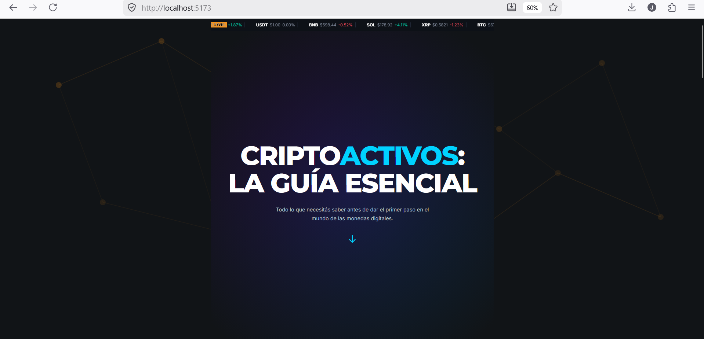
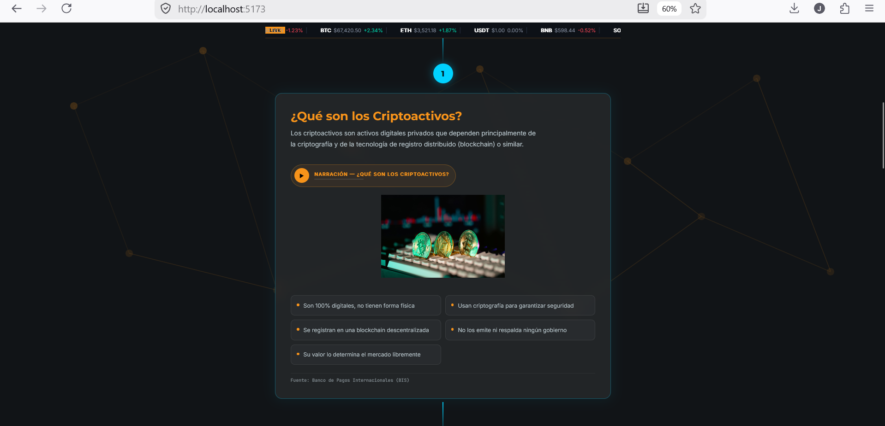
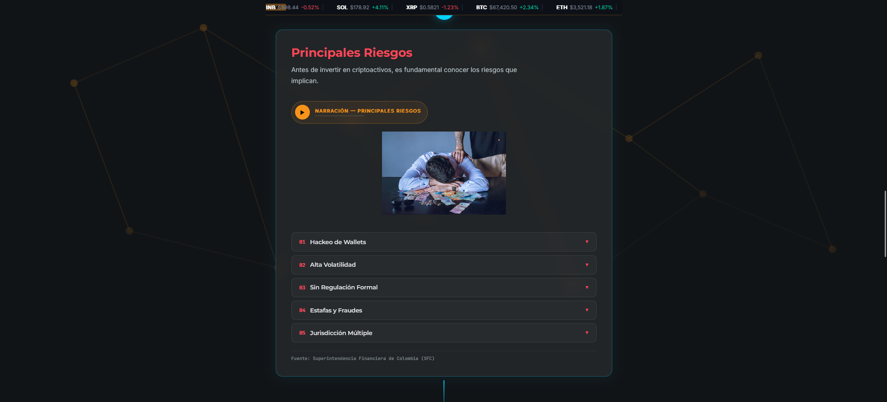

# Cripto Infografía Interactiva

**Proyecto Personal · IF7102 Multimedios · UCR · I Ciclo 2026**

## Opción elegida
Opción 2 — Infografía Interactiva Animada sobre Criptoactivos

## Framework elegido
React 19 + Vite

## Stack tecnológico
- React 19.2.7
- Vite
- CSS puro
- fetch() nativo
- SVG nativo
- HTMLAudioElement nativo

## Cómo ejecutar
```bash
npm install
npm run dev
```

## Capturas de pantalla





## Autor
Joshua Obando Gonzalez · Informática Empresarial · UCR · I Ciclo 2026
